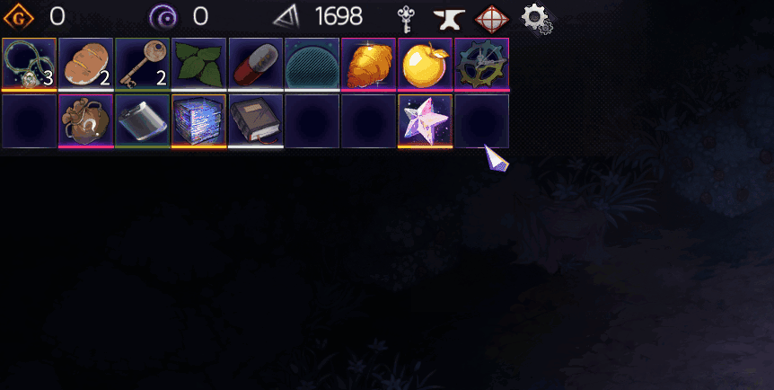

# Chrono Ark Solo Mode Tradable Celestial
Allows trading Celestial for 1000 gold in the Lone but Not Lonely Wolf challenge where Celestial cannot be used.  
> Made on request!

## Requirement
- [Visual Studio Community 2022](https://visualstudio.microsoft.com/)
  - Desktop application development with .NET framework/CSharp.

## Building
You need to set environment variable `ChronoArkGamePath` to game's install directory. (e.g. `steamapps/common/Chrono Ark`).

## LICENSE

[MIT](LICENSE)

